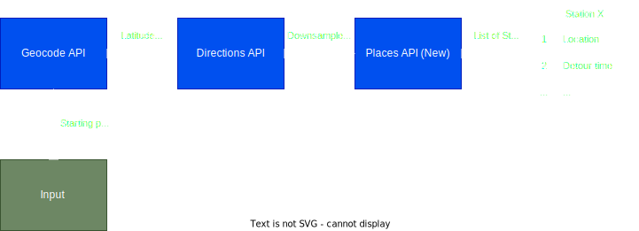

# Data Pipeline — Component README

Table of Contents
1. [Purpose & quick summary](#1-purpose--quick-summary)
2. [Where this fits in the pipeline](#2-where-this-fits-in-the-pipeline)
3. [Inputs & Outputs](#3-inputs--outputs)
4. [How it works (high level)](#4-how-it-works-high-level)
5. [Automation hooks](#5-automation-hooks)
6. [Validation & quality checks](#6-validation--quality-checks-data)
7. [Error handling & troubleshooting](#6-validation--quality-checks-data)
8. [Configuration (.env.example)](#8-configuration-envexample)
9. [Links](#9-links)

## 1) Purpose & quick summary
`data_pipeline` — Responsible for automated acquisition and preparation of fuel stations along a route and price data for downstream modeling and decision modules. The component is intended to produce station records and a rolling price table for all stations in Germany.

For non-technical readers: This component gathers fuel station locations and price feeds, enriches them with route, detour & ETA context, and delivers datasets so the app and models can recommend where and when to refuel.

See sections below for exact inputs, outputs, validation checks, and automation hooks.

## 2) Where this fits in the pipeline
- Upstream: UI/Integration that provides starting point/destination; external data providers (Tankerkönig CSV releases; Google Maps APIs).  
- Downstream: `src/integration` (create full dataset)`src/modeling` (price forecasting), `src/decision` (stop optimizer), `src/app` (dashboard and route recommendations).

## 3) Inputs & Outputs

- Inputs
  - `route_stations.py`: origin/destination address (`str`), `GOOGLE_MAPS_API_KEY` (env). Example: "Berlin, Germany".
  - `update_prices_stations.py`: Tankerkönig CSVs accessible via authenticated URL (constructed using `TANKERKOENIG_EMAIL` and `TANKERKOENIG_API_KEY` in env) and Supabase credentials (`SUPABASE_URL`, `SUPABASE_SECRET_KEY`).

- Outputs
  - `route_stations.py` returns a list of station records (dict) with fields (example schema):

    - `name` (string)
    - `lat` (float)
    - `lon` (float)
    - `eta` (ISO8601 string)
    - `detour_distance_km` (float)
    - `detour_duration_min` (float)
    - `distance_along_m` (int)
    - `fraction_of_route` (float)
    - `opening_hours` (list; human-readable)
    - `opening_periods` (list of dicts)
    - `is_open_at_eta` (bool or null)
    - `open_now` (bool)
  - `update_prices_stations.py` updates two Supabase tables: `stations` (full refresh) and `prices` (rolling inserts). Logs are written to a local log directory.

Schema of `stations` table

| Column | Type | Nullable | Description |
|--------|------|----------|-------------|
| `uuid` | uuid | NOT NULL | Primary key, unique station identifier from Tankerkönig |
| `name` | text | YES | Station name (e.g., "Shell Tübingen Nord") |
| `brand` | text | YES | Brand name (e.g., "Shell", "Aral", "Esso") |
| `street` | text | YES | Street name |
| `house_number` | text | YES | House/building number |
| `post_code` | text | YES | German postal code (5 digits) |
| `city` | text | YES | City name |
| `latitude` | float8 | YES | Geographic latitude (decimal degrees) |
| `longitude` | float8 | YES | Geographic longitude (decimal degrees) |
| `first_active` | timestamp | YES | First recorded date station was active (German time) |
| `openingtimes_json` | jsonb | YES | Opening hours in JSON format (often empty: `{}`) |

```sql
uuid: 44e2bdb7-13e3-4156-8576-8326cdd20459
name: bft Tankstelle
brand: NULL
street: Schellengasse
house_number: 53
post_code: 36304
city: Alsfeld
latitude: 50.7520089
longitude: 9.2790394
first_active: 1970-01-01 01:00:00
openingtimes_json: {}
```

Schema of `prices` table

- **Primary Key:** `(date, station_uuid)` (composite)

| Column | Type | Nullable | Description |
|--------|------|----------|-------------|
| `date` | timestamp | NOT NULL | Price timestamp (German local time, no timezone) |
| `station_uuid` | uuid | NOT NULL | unique station identifier from Tankerkönig |
| `diesel` | numeric | YES | Diesel price in €/liter |
| `e5` | numeric | YES | E5 (Super) price in €/liter |
| `e10` | numeric | YES | E10 (Super E10) price in €/liter |
| `dieselchange` | int2 | YES | Diesel price change flag (0=no change, 1=increased, -1=decreased) |
| `e5change` | int2 | YES | E5 price change flag |
| `e10change` | int2 | YES | E10 price change flag |
|`is_synthetic` | bool | NO | Synthetic data row yes/no

```sql
date: 2025-11-14 00:01:26
station_uuid: d4a4644c-cd86-42a5-9cfa-ec6c58204312
diesel: 1.599
e5: 1.739
e10: 1.679
dieselchange: 1
e5change: 0
e10change: 0
```

- **Change Flags:**
  - `0` = no change from previous price
  - `1` = price increased
  - `-1` = price decreased

## 4) How it works (high level)
- `route_stations.py` (Google Maps integration)
  - Geocoding is performed for human-readable addresses.  
  - Driving route geometry and ETA are obtained from the Directions API; step polylines are decoded for map display and downsampled for places API.  
  - The Places API is queried along the route corridor (search-along-route). For each candidate station, a detour is computed by measuring the shortest path O→station→D versus original route. ETA at the station is estimated using step timing. Opening times are parsed to indicate accessibility at ETA.
  - The function returns station records suitable for modeling and UI ranking.

<picture>
  <source media="(prefers-color-scheme: light)" srcset="../../structure_graphs/light_theme_route_stations_workflow.drawio.svg">
  
</picture>


- `update_prices_stations.py` (Tankerkönig ingestion)
  - A daily job downloads latest CSVs from the Tankerkönig raw repository (authenticated via credentials in env), normalizes types and timestamps, and replaces the `stations` table (full refresh).
  - Price records are cleaned, older-than-14-days price rows are pruned, and synthetic rows are generated for 00:00–06:59 to ensure modeling coverage at early hours. Insertions are batched and logged. 

Notes:
- Both scripts expect environment variables (see Configuration). A `.env` file at repo root may be used for local testing.

## 5) Automation hooks
- Intended triggers:
  - `update_prices_stations.py` is intended to be scheduled daily at a fixed CET time (e.g., 07:00 CET).  
  - `route_stations.py` is intended to be called on-demand by the application backend when a user requests a route recommendation.

## 6) Validation & quality checks data
- Environment check: verify the Google API key is present
- Plausibility:
  - Geocoding returns valid lat/lon
  - Detour distance/duration must be > 0; invalid records are rejected.
  - Stations candidates without coordinates or without a valid detour route are skipped

```diff
- Environment checks: required env vars are validated at start; missing critical keys cause a `ConfigError` and early exit.
- Schema checks: downloaded CSVs are checked for expected columns and valid types; malformed rows are logged and either coerced or dropped depending on severity.
- Determinism: route decoding and ETA calculations are deterministic given the same inputs and API responses.
- Operational checks: insert success rates and row counts are logged; a post-run summary is produced with counts of inserted/failed rows.
```

## 7) Error handling & troubleshooting
- Common failure modes and mitigations:
  - Missing environment variables → fix `.env`. Example: `GOOGLE_MAPS_API_KEY` absence causes `ConfigError`.
  - Supabase auth errors → verify `SUPABASE_URL` and `SUPABASE_SECRET_KEY` and ensure service role has insert/delete privileges.
  - Tankerkönig CSV not found → verify `TANKERKOENIG_EMAIL` and `TANKERKOENIG_API_KEY` and check the expected date path in the remote repo.

Troubleshooting steps:
1. Inspect logs (default log folder is the user profile `logs` directory or `LOG_DIR` if set).   
2. For API issues, record request IDs and timestamps.

## 8) Configuration (`.env.example`)
Create a `.env` file from the example below.
```ini
# .env.example — copy to .env and fill values
SUPABASE_URL=<https://your-project.supabase.co>
SUPABASE_SECRET_KEY=<SUPABASE_SERVICE_ROLE_KEY>

TANKERKOENIG_EMAIL=<YOUR_TANKERKOENIG_EMAIL>
TANKERKOENIG_API_KEY=<YOUR_TANKERKOENIG_API_KEY>

GOOGLE_MAPS_API_KEY=<YOUR_GOOGLE_MAPS_API_KEY>
```

## 9) Links
- Root README: [../../README.md](../../README.md)
- Integrion: [../integration/README.md](../integration/README.md)
- Modeling component: [../modeling/README.md](../modeling/README.md)
- App/UI component: [../app/README.md](../app/README.md)

## Mini file tree
```
src/data_pipeline/
├─ README.md
├─ route_stations.py
└─ update_prices_stations.py
```