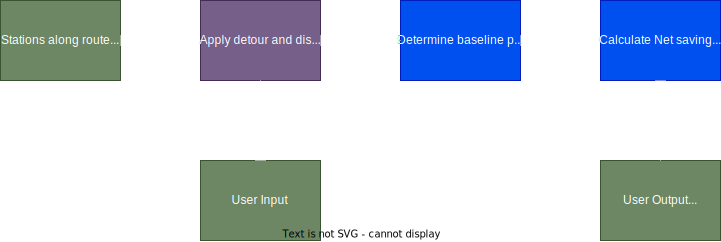

# Decision Layer – Component README

Table of Contents  
1. [Purpose & quick summary](#1-purpose--quick-summary)  
2. [Where this fits in the pipeline](#2-where-this-fits-in-the-pipeline)  
3. [Inputs & Outputs](#3-inputs--outputs)  
4. [How it works (high level)](#4-how-it-works-high-level)  
5. [Automation hooks](#5-automation-hooks)  
6. [Validation & Quality checks](#6-validation--quality-checks)  
7. [Error handling & troubleshooting](#7-error-handling--troubleshooting)  
8. [Links](#8-links)
9. [Mini file tree](#9-mini-file-tree)

## 1) Purpose & quick summary
Responsible for selection and ranking refueling stations using predicted prices, detour costs, and user constraints to recommend the best stop with minimal user effort.

For non-technical readers: Turns model outputs into an easy, automated “where to refuel” recommendation.

## 2) Where this fits in the pipeline
- **Upstream:** `src/integration` layer provides enriched station dictionaries with routing features; `src/modeling` layer supplies price predictions.  
- **Downstream:** UI/dashboard return the ranked list and the recommended stop for display and booking.  


## 3) Inputs & Outputs
- **Inputs (data contracts):**
  - `stations: List[Dict]` with keys like `pred_price_<fuel>`, `detour_distance_km`, `detour_duration_min`, `distance_along_m`, `station_uuid`.
  - User parameters: `fuel_type`, `litres_to_refuel`, `consumption_l_per_100km`, `value_of_time_per_hour`, `max_detour_km`, `max_detour_min`, `min_distance_km`, `max_distance_km`.
- **Outputs:**
  - Ranked list with injected economics fields (e.g., `econ_net_saving_eur_<fuel>`, `econ_detour_fuel_cost_eur_<fuel>` and `net_saving_eur`.

## 4) How it works (high level)

**Code documentation:** All code throughout this component is extensively commented with inline documentation explaining function logic, variables and rules. For low-level implementation details refer directly to the source code files listed in the [Mini file tree](#9-mini-file-tree) section—each file contains detailed comments.

- The requested fuel_type is normalized. Missing predictions trigger predict_for_fuel.
- Implausible prices are filtered (>= 0.50 €/L guard); duplicates per UUID are resolved by keeping the lowest price.
- **Mode selection:**  
  - Economic mode (when `litres_to_refuel` and `consumption_l_per_100km` are valid): baseline on-route price → gross/net savings → detour fuel/time costs → breakeven liters → rank by net saving.  
  - Price-only fallback: rank by predicted price when economic inputs are absent.
- Sorting favors net savings (economic) or predicted price (fallback) with route-progress tie-breakers. Optional audit log records inclusion/exclusion reasons for transparency.

High level structure graph
<picture>
  <source media="(prefers-color-scheme: light)" srcset="../../structure_graphs/light_theme_recommender.drawio.svg">
  
</picture>

## 5) Automation hooks
- Invoked from the service layer/API without manual steps; predictions are auto-fetched if missing.

## 6) Validation & Quality checks
- Price validity check (`>= 0.50 €/L`) and NaN/None rejection.
- Detour caps (distance/time) with defaults in economic mode to enforce feasibility.
- Optional distance window filters (`min_distance_km`, `max_distance_km`).
- Audit log captures exclusion reasons and thresholds for transparency and testing.

## 7) Error handling & troubleshooting
- **Missing predictions:** Automatically inferred; ensure modeling weights are available.  
- **Invalid fuel type:** Ensure `fuel_type` ∈ `FUEL_TYPES`; otherwise a `ValueError` is raised.  
- **All stations filtered:** Relax detour caps or net-saving threshold; check upstream routing fields.  
- **Baseline not computed:** Component falls back to price-only mode; verify on-route candidates.

## 8) Links
- [Back to Root README](../../README.md)
- Related components:
  - Integration: [../integration/README.md](../integration/README.md)
  - Modeling component: [../modeling/README.md](../modeling/README.md)
  - App/UI component: [../app/README.md](../app/README.md)

## 9) Mini file tree
```
src/decision/
├─ README.md
└─ recommender.py
```
