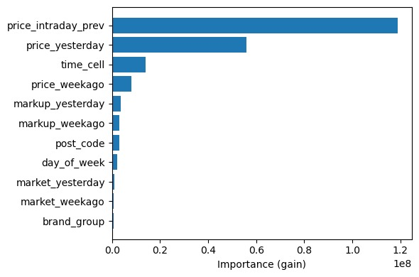

# Modeling - Component README

Table of Contents  
1. [Purpose & quick summary](#1-purpose--quick-summary)  
2. [Where this fits in the pipeline](#2-where-this-fits-in-the-pipeline)  
3. [Inputs & Outputs](#3-inputs--outputs)  
4. [How it works (high level)](#4-how-it-works-high-level)  
5. [Automation hooks](#5-automation-hooks)  
6. [Validation & quality checks](#6-validation--quality-checks)  
7. [Error handling & troubleshooting](#7-error-handling--troubleshooting)
8. [ Model selection rationale](#8-model-selection-rationale) 
9. [Links](#9-links)  

## 1) Purpose & quick summary

`modeling` — Responsible for horizon-aware predictions of fuel prices at gas stations using fitted ARDL (Autoregressive Distributed Lag) models. The component transforms station data with price lags and ETAs into actionable price forecasts for downstream analysis and dashboard presentation.

For non-technical readers: This component uses econometrics to predict fuel prices at stations along a route, so the app can recommend optimal refueling decisions.

## 2) Where this fits in the pipeline

- **Upstream:**  
  - `src/integration` (enriched station data with price lags and ETAs)  
  - `src/data_pipeline` (data sources)
- **Downstream:**  
  - `src/decision` (stop optimization and recommendation logic)  
  - `src/app` (dashboard/UI presentation)

## 3) Inputs & Outputs

- **Inputs**
  - List of station dictionaries, each containing:
    - Required lagged price features (e.g., `price_lag_1d_e5`, `price_lag_2d_e10`, `price_lag_7d_diesel`, etc.)
    - Current price (if available)
    - ETA (estimated time of arrival)
    - Time cell (integer, 0–47 indicating position in current/next day)
    - Other metadata as needed

- **Outputs**
  - Annotated station dictionaries with:
    - Predicted price for each fuel (`pred_price_e5`, `pred_price_e10`, `pred_price_diesel`)
    - Error flags if prediction could not be performed

Example input station dict:

```python
{
  ...existing fields...,
  "price_lag_1d_e5": 1.789,
  "price_lag_2d_e5": 1.799,
  "price_lag_3d_e5": 1.809,
  "price_lag_7d_e5": 1.759,
  "price_current_e5": 1.799,
  "eta": "2026-01-22T15:30:00Z",
  "time_cell": 31,
  "fuel_type":"e5"
  ...
}
```

## 4) How it works (high level)

**Code documentation:** All code throughout this component is extensively commented with inline documentation explaining function logic, variables and rules. For low-level implementation details refer directly to the source code files. Each file contains detailed comments.

- For each station and fuel type, the component:
  1. Determines the prediction horizon based on ETA and current time (minutes-based logic).
  2. Selects the appropriate ARDL model (h0 for daily-only, h1–h4 for intraday).
  3. Builds the feature vector using generic column names.
  4. Loads the model from disk (`.joblib` files in `src/modeling/models/`).
  5. Runs the prediction and writes the result back into the station dict.

- If current price is unavailable, fallback logic ensures robust predictions or flags missing data.

## 5) Automation hooks

- Intended triggers:
  - Called directly via Python from the main pipeline script (`predict_all_fuels` function)

- Automation features:
  - Models are loaded automatically and cached (LRU cache) for efficiency
  - All logic is encapsulated; users do not need to modify code

## 6) Validation & quality checks

- Checks for presence of all required lag features before prediction
- Validates fuel type and ETA format

## 7) Error handling & troubleshooting

**Common failure modes:**
- Missing model files: Raises `PredictionError` with remediation instructions
- Invalid fuel type: Raises `ValueError` with valid options
- Incomplete feature vector: Skips prediction, output remains `None`
- ETA parsing errors: Falls back to cell-based logic

## 8) Model selection rationale

Before estimating the ARDL models, we experimented with a Gradient Boosting approach (LightGBM) to assess whether a flexible machine-learning model could capture additional predictive structure. The analysis of feature importance (gain) revealed that model performance is largely driven by simple lagged price information, while most other features contribute only marginally.



This finding suggests that short-term price dynamics are primarily governed by temporal dependence rather than complex nonlinear interactions. Consequently, we transitioned to a dedicated time-series framework using ARDL models. As a transparent benchmark, we therefore use the previous day’s price as the baseline reference against which more advanced models are evaluated. 

The ARDL models achieve lower monthly MAE than the simple lag-1 baseline (“yesterday’s price”), indicating a performance gain from explicitly modeling time-series dynamics.

**Horizon-Specific Models:**
- Five ARDL variants trained, each tailored to different prediction horizons (h0–h4):
  - **h0_daily**: Uses only daily lags (1d, 2d, 3d, 7d) for predictions ≥5 cells ahead
  - **h1_1cell** – **h4_4cell**: Combine daily lags with intra-day lags (1cell–4cell) for tighter horizons
## 9) Links

- [Back to Root README](../../README.md)
- Related components:
  - Integration: [../integration/README.md](../integration/README.md)
  - Decision: [../decision/README.md](../decision/README.md)
  - App/UI: [../app/README.md](../app/README.md)